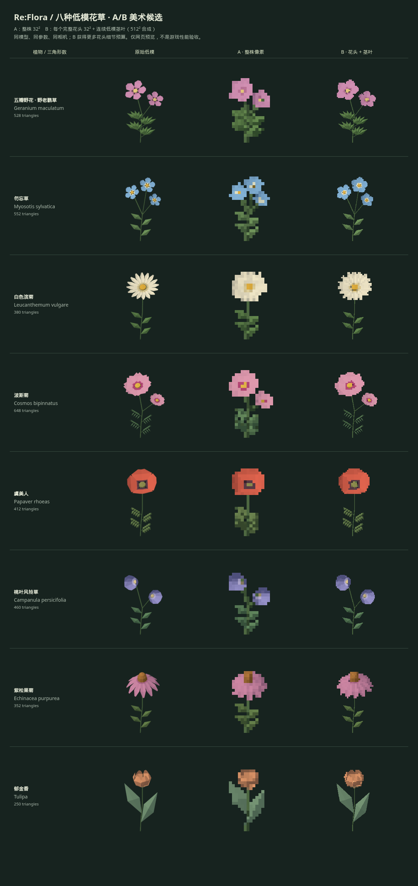
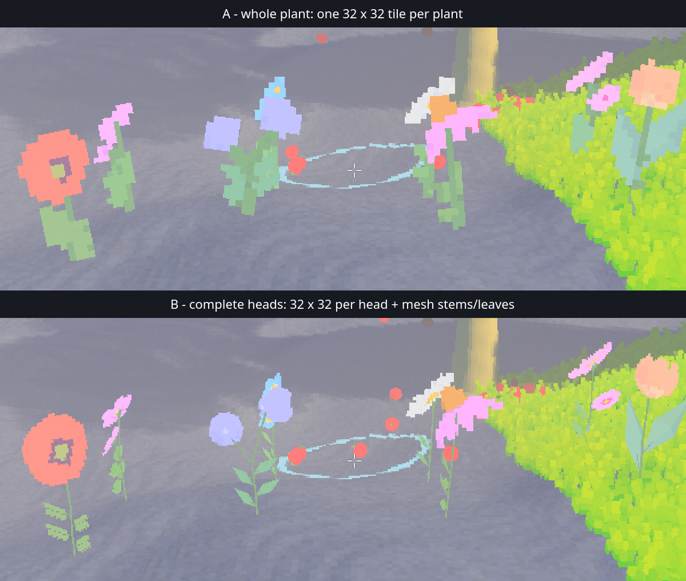

# 花草低模与像素化对照：8 种候选

## 调研与目标

在既有 [模型像素化预览台](../../experiments/model-preview/README.md) 中增加 8 个独立下拉选项，每种有完整低模、造型／配色参数和实时像素结果。不是下载一批版权不明模型，也不另建 HTML。模型是参考植物识别特征后编写的原创参数化网格，沿用苹果／叶片的 JavaScript 配方 → Three.js → 共享像素管线。

### 网上艺术化 demo 参考

- **[RRFreelance · Stylised Low Poly Flowers and Pots](https://rrfreelance.itch.io/stylised-low-poly-flowers-and-pots)**：作者展示整组淡彩低模花草、五瓣小花、放射状花盘、杯状花、宽叶与细茎；说明采用渐变贴图取得 pastel tones。借鉴的是「少量大色面 + 清楚花瓣轮廓 + 细长茎」的表达，不复制其网格／纹理。页面为付费资产，未购买、未下载、未打包其图片。
- **[Lunar64x · Low-Poly Nature Pack](https://lunar64x.itch.io/lunar64x-low-poly-nature-pack)**：作者页面提供可运行森林 demo，明确列出 daisies、sunflowers、lavender，以及可拼接叶片、joined / modular 版本与枢轴。支持本实验把花头与茎叶作为制作单元的方向；不把页面的 code license 当成所有素材的统一授权。本次只阅读介绍／展示，不引入第三方资产。

下列各植物外形依据 **NC State Extension 的 Plant Toolbox 物种页及照片**，每行给出直接来源。照片只用于在线观察，不复制到仓库。花数、低模面数和夸张比例是本项目美术选择，**不是精确植物学复刻**；菊科“花瓣”实际是舌状花，界面用易懂的美术称呼。

## 候选与建模方案

| 下拉名称 / ID | 名称与一手参考 | 可识别的样子 | 本次低模表达与观察重点 |
| --- | --- | --- | --- |
| 五瓣野花 · 野老鹳草 / `wild-geranium` | **Wild geranium / Geranium maculatum**；[物种页](https://plants.ces.ncsu.edu/plants/geranium-maculatum/) | 粉红至淡紫、向上开的浅碟形五瓣花，瓣上有细脉；掌状裂叶，花序有数朵。 | 两个错高的五瓣花头；圆钝瓣、浅凹花心、掌状低模叶。省去细脉，保留瓣间负空间。重点比较 32px 整株里五瓣能否辨认。 |
| 勿忘草 / `forget-me-not` | **Woodland forget-me-not / Myosotis sylvatica**；[物种页](https://plants.ces.ncsu.edu/plants/myosotis-sylvatica/) | 小型蓝色五裂花，黄／白色眼，成密集花序，叶片细长。 | 三朵不同朝向的蓝色小花、浅色喉圈与黄点；不做数十朵噪点。每一朵是一个完整像素单元，不把单瓣拆成精灵。 |
| 白色滨菊 / `oxeye-daisy` | **Oxeye daisy / Leucanthemum vulgare**；[物种页](https://plants.ces.ncsu.edu/plants/leucanthemum-vulgare/) | 白色狭长舌状花围绕扁黄盘；自然标本约 15–35 条白色射线，单头位于茎端。 | 用 16 条可读的窄瓣与低矮黄盘；小侧叶衬托大花盘。测试窄瓣在低像素下是否糊成一圈。 |
| 波斯菊 / `cosmos` | **Garden cosmos / Cosmos bipinnatus**；[物种页](https://plants.ces.ncsu.edu/plants/cosmos-bipinnatus/) | 粉、白、紫红色浅碟花盘，黄色中心，叶片深裂、轻盈如羽。 | 八片宽瓣、略有缺口的瓣缘、深粉内圈与细分叶；与滨菊区别在宽瓣、轻茎和羽状叶，不只换色。 |
| 虞美人 / `corn-poppy` | **Corn poppy / Papaver rhoeas**；[物种页](https://plants.ces.ncsu.edu/plants/papaver-rhoeas/) | 四片红色皱瓣形成杯／碟，瓣根常有黑斑；细长花梗，叶深裂。 | 四大片起伏杯状瓣、暗色瓣根与种荚状花心；少面数表达纸片感。侧／背面检查杯深，而不只看正面圆片。 |
| 桃叶风铃草 / `bellflower` | **Peach-leaved bellflower / Campanula persicifolia**；[物种页](https://plants.ces.ncsu.edu/plants/campanula-persicifolia/) | 蓝紫／白色、向外开的钟形合瓣花，五裂口；细直茎、披针叶。 | 两朵错高、略倾斜的五裂钟杯，闭合花底、可见内壁和花蕊。与自由花瓣完全不同的连体花冠，检验侧视和接茎。 |
| 紫松果菊 / `coneflower` | **Purple coneflower / Echinacea purpurea**；[物种页](https://plants.ces.ncsu.edu/plants/echinacea-purpurea/) | 粉紫色长瓣向外下垂，中央高起的棕橙色刺状圆锥盘，茎直且叶较宽。 | 12 条下垂瓣、橙褐色立体锥盘、大尖叶；省去密刺，用切面表示。检验高花心与下垂瓣的深度关系。 |
| 郁金香 / `tulip` | **Tulip / Tulipa**；[属级参考](https://plants.ces.ncsu.edu/plants/tulipa/) | 多为单朵直立杯形；六片花被，两轮排列；基部长而宽的叶。颜色与形状因品种变化很大。 | 六片交叠暖橘花被形成高杯，黄内侧、两片宽蜡质叶。作为园艺对照，不声称是特定野生物种；测试厚杯形与宽叶搭配。 |

## 网页 A/B 的明确含义

预览右侧新增 **“仅花头像素化，再拼接茎叶（实验 B）”** 复选框，仅花卉可用，默认不勾选。原来的保守覆盖开关仍独立存在。

- **A／未勾选：整株像素化。** 花、萼、茎、叶共同进入一个 N×N 缓冲，调用原有几何保守覆盖与八邻接补点；右侧最近邻放大。
- **B／勾选：完整花头像素化后拼接。** 每个完整花冠、花心与花萼共用一个 N×N 单元，而不是每片花瓣一张图。单元仍复用相同补点算法；茎叶保持低多边形连续渲染。所有部分使用同一世界姿态、光照、观察方向和锚点。右侧是较高分辨率透明合成，不冒充整张 N×N 图片。
- 同一个 N 在 A 中属于**整株**，在 B 中属于**每个花头**，因此 B 的花头得到更多细节预算；这本来就是要比较的资产拆分决策，**不是同预算性能 A/B**。界面和导出名必须明确标记。
- 左侧始终是完整原始 3D 模型，A/B 不改变模型、材质、相机或参数。B 只改变像素处理单元和组合方式，不通过放大花瓣、换模型或更改色彩作弊。
- 全部设置只在本次网页会话有效，切模型／重置恢复默认。不修改 `config/gui.toml`，也不新增游戏 Debug 控件。

## 已交付与观察

已在原 HTML 的同一下拉框接入上述 8 种，各 **250–648 个三角形**；原有落叶、蝴蝶、苹果仍保留。建模配方位于 `assets/models/flower-source.mjs`，适配层为 `models/flowers.js`。没有 Blender 运行依赖、CDN、外部贴图或需另行安装的网页依赖。

下面是自动化运行真实 WebGL 输出的对照，不是概念图。每行依次为原始低模、A 整株 32²、B 每个完整花头 32² 后合成。全部是本项目原创网格截图，无第三方图片。



视觉观察：A 的整体像素密度统一，但小花五瓣、菊花细瓣和羽状叶容易被保守覆盖连成色团；B 保留茎叶轮廓、放大花头细节预算，但连续茎叶与像素花的混合感更明显。B 仍可能合并极细瓣缝，**没有为花草暗改原补点算法**。两种均保留供用户选择，目前不替用户确定最终方向。

### 复现

```sh
node scripts/serve-model-preview.mjs
# http://127.0.0.1:8765/model-preview/?model=wild-geranium
node --test experiments/model-preview/tests/*.test.mjs
# 与原浏览器验证相同，Playwright 可通过 NODE_PATH 提供。
node experiments/model-preview/tests/browser.cjs
node experiments/model-preview/tests/flowers-browser.cjs
```

完整截图／逐植物透明 PNG／JSON 在 `target/flower-study/validation/`，可通过 `PREVIEW_ARTIFACT_DIR` 改输出位置。两个模式的 PNG 文件名区分 `whole` 与 `heads-512px-composite`；B 导出不是 32² 整株，而是 512² 合成。

### 已执行的验收

- Node：**22 项通过**，包括 8 种配方确定性、有限顶点、低面数、完整花头分组、每个造型控制有效、深度解码与补点深度。
- Chrome / SwiftShader：**176 个花头姿态样本**，覆盖 8 种花的正交／透视、正背侧、8/32/64px，另有每种 128px 和参数端点。逐像素检查补点不覆盖原始 RGBA；120,078 个非边界中心采样的 GPU 深度核对，最大绝对深度误差约 `1.013e-6`（归一化深度）。
- **8 个遮挡夹具**：两种投影下，茎在花前／花后、花头在另一个花头前／后；不是统一写入花头中心平面深度。新增覆盖像素的深度依然是几何估计，不宣称精确子像素积分。
- 所有花的 A→B→A 原图恢复一致；B 不改变左侧模型；线框、检查缩放不污染右侧；造型与颜色参数、覆盖开关、两种 PNG 尺寸／透明背景、模型切换／重置均通过。
- 反复切换模型与像素分辨率后 GPU 几何／纹理计数稳定；1440×1000、1280×720、390×844 已截图并人工查看，无横向溢出；没有页面／控制台／请求错误或外网请求。
- 原有浏览器回归（包括旧入口跳转）通过：叶片、蝴蝶、苹果、动画、颜色、覆盖与导出未退化。
- 网页阶段的机器可读摘要：[summary.json](../evidence/stylized-flowers/summary.json)。网页验收不代替游戏隐藏 Release 验收；后续原生集成和独立验证见下文。

## 后续授权：原生游戏集成

已把这 8 种加入游戏 **第二个物品栏的 Grow／种植工具（快捷键 2）→ 右侧 Plant Brush 植物栏**，保留原有草、花和藤蔓。列表可滚动，矮窗口下也能选到最后的郁金香；种植时右侧优先显示植物栏，背包状态栏不再遮住它。它们走现有手工种植、土壤水分／生长、删除、重种与植被风响应生命周期，不是只叠在相机前的演示精灵。

**Debug → Flora → Ground Plants → Model Flowers (A/B)**：

- **Pixel Flower Heads + Mesh Stems**：游戏默认勾选 B；取消勾选即 A 整株像素化。运行中切换，同一批已种植植物不重建、不换形状。
- **Pixels per Plant / Flower Head**：8–64，默认 32；只调这 8 种花，不改变苹果、落叶或蝴蝶。
- **Model Flower Size**：0.5×–2×，默认 1×。基础换算为每制作单位 10 个世界体素。
- 三项均由 `config/gui.toml` 声明，使用正常 Save 流程；不是 App 临时滑杆。网页控制仍只影响网页。

### 资产、姿态与管线

唯一制作源为 `assets/models/flower-source.mjs`，`node scripts/publish-flower-models.mjs` 发布 `assets/models/flowers.json`。游戏嵌入这个确定性产物；构建校验源／发布器指纹。8 个模型共 **3,582 个三角形**，各自最多 3 个完整花头，茎叶和花萼不重新手写一套形状。

`flower_model.slang` 统一根位置、生长缩放、种植出土、自然倾斜和风响应；花头和网格茎叶共用这一个根姿态。B 的茎叶现已成为真正的游戏原生网格绘制，不再只是网页代理；目前采用整株共享的根部摆动，不是新增逐茎柔性模拟。

花头／整株均调用已有 `sampleModelPixelGeometry`／正交包装和 `model_pixel_display.slang`；没有另造补点算法。原生游戏沿用既有离散视向、物体光照与屏幕网格规则，因此不承诺与网页的连续相机、工作室光源逐像素相等。模型深度写入游戏深度附件，与地形、茎叶、其他花头共同遮挡，而不是只用一张中心平面深度。

GPU 几何在 `src/tracer/flower_models.rs`；计算—绘制配对、分辨率变化和帧槽存储仍由 `ModelPixelFrame`／`ModelPixelStorage` 管理。窗口尺寸／DDGI 描述符代际仍归 `PipelineTopology`，不建立独立的缓存与资源退休机制。模型物种不进入体素花草绘制／体素光照缓存。

### 原生实拍

下面两张来自真实隐藏 Release 游戏截图的同区域裁切，未缩放。**上 A，下 B**。8 株在 A 是 8 张 32²，在 B 是 13 张 32² 加网格茎叶，仍然不是同预算比较。两个进程中的风、落果等世界动画仍在运行，不是冻结同一帧的精确差分。



[种植入口实拍：第二栏 Grow 与右侧 Plant Brush](../evidence/stylized-flowers/native-grow-panel.png)（完整画面缩至 1440×810；列表向下滚动可见其余新花）。

观察：B 明显保留细茎、分枝和叶间空隙；A 更像厚重的像素雕塑。当前原生色彩／亮度来自游戏环境，是否还需统一花头与茎叶的视觉密度，留给实际视觉试用决定，不以测试通过替代美术批准。

### 原生验证与复现

```sh
cargo fmt --check
cargo check
cargo test
cargo run --release -- --hidden --mute --auto-exit 0.5
node scripts/validate-flower-models.mjs
node scripts/validate-flower-snapshots.mjs
# 慢设备可延长实际渲染时间；用 --help 查看条件、输出和退出码：
node scripts/validate-flower-models.mjs --seconds 20
cargo run --release -- --latest-log
```

验证器只在显式 `RE_FLORA_FLOWER_MODEL_REVIEW=a|b|ab` 下建立种植夹具，在内存中切换真实 GUI 绑定输入；不保存 Debug 设置或地形。固定 A/B 用于截图；`ab` 在同一进程执行 9 阶段，包括：A→B(8/32/64)→A→B、连续投影诊断、屏幕对齐像素、0.5×／2×尺寸与生长量、删除／重种最后一株。配合已有 `--resize-lifecycle-test`，会在已提交花草绘制后再次触发窗口重建。

本次已执行：

- Cargo **1,233 通过，4 项按原有策略忽略**；全套既有测试通过。新纯逻辑护栏覆盖模型注册／三角形范围、GPU 布局、参数冻结与边界、花头批次的全局索引和物种／区块／帧槽隔离。原有 3 个藤蔓测试仍较慢，本次未顺手修改。
- 真实 egui 输入测试在 640×480 下滚动并逐个点击全部 8 种新花，核对返回实际种植选择索引；修复前最后一项不可达，修复后全部通过。原生截图也显示快捷键 2 的 Grow 选中及右侧 Plant Brush。
- 普通隐藏静音 Release 启动／退出通过。
- 真实 Vulkan A、B、实时 9 阶段全部通过；各阶段检查 8 个物种的实际 draw，删除阶段为 7、重种恢复 8。重建后帧、swapchain、tracer 代际一致；植被响应 GPU 护栏通过；最终三个夹具运行没有 Vulkan validation 或其他 error，退出 `failures=0`。
- 三个夹具运行前后 `config/gui.toml` SHA-256 不变。两张完整实拍均为 2880×1620。
- 重新跑过 22 个 Node 测试、原浏览器回归和 176 个花头姿态／8 个深度遮挡夹具，无页面／控制台／请求错误。
- 存档兼容另经真实 Release 校验：现格式包含全部 8 种新花；历史 4 物种格式及 4＋退役 Kochia 格式均能加载。每种格式完成启动加载及两次运行中替换，核对地形、植物生长／身份、树木完全一致且无重复。只对明确的历史格式补空槽，不吞掉未知格式。临时测试存档成功后自动删除，不读取玩家存档。
- 原生机器摘要：[native-summary.json](../evidence/stylized-flowers/native-summary.json)。完整图片和日志在 `target/flower-native-review/`；截图裁切、右侧种植栏实拍与已验证代码提交 `6c578c60` 记录在摘要里。

### 当前边界

这是可种植、可实时比较的视觉候选，**未进行大量花草实例的 Release 性能验收，也不是发布打包**。B 的更多瓦片及逐实例采样成本不能用网页帧率或小夹具结果代替测量。没有新增花草专用碰撞体、专用阴影投射或逐茎弯曲模拟；不更改原有苹果物理和叶片飞行。视觉获批后再单独决定密集种植的预算与优化。

密集种植反馈后的 [Release 性能诊断](../performance/model-flowers-diagnosis.md) 已确认严重瓶颈：历史共享表面缓存在 `6bae0d62` 中被移除，新花继承了逐实例／逐帧实时采样，加上仅区块级剔除，背对花丛仍付出完整生成成本。128 株默认花头模式约需 18–19 ms/帧的几何生成。后续已[恢复共享表面缓存](../performance/model-pixel-cache.md)，并让花、苹果、模型叶子和蝴蝶共同使用；同一 128 株背对场景的花头生成降至约 0.075 ms。上述小夹具本身仍不代表最大种植规模性能验收。

花头的制作单元始终是完整花冠＋花心＋花萼，不是单片花瓣。静态制作源不会伪造花瓣动画；网页转台与游戏根部风摆分别承担观察和世界姿态。
