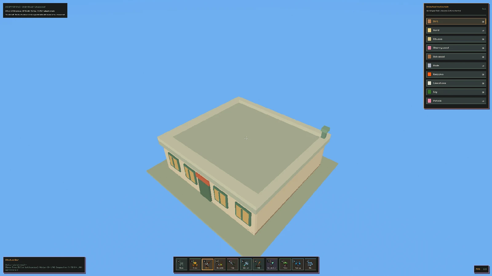

# Rooftop Proof of Concept

Status: implemented experimental candidate on `agent/gamify`; manual feel review remains open.

Validated: 2026-10-01. Authority: [Game Direction](game_direction.md).

This is an independent, unsaved space/planting proof, not a shipped restaurant game or a completed
First Garden Moment. Apples, supply, sales, purchases and new tools remain deferred.

## Try the candidate

From this worktree, when a visible try-out is wanted:

```bash
cargo run --release -- --rooftop-poc
```

- Starts with a bare model roof, no terrain soil, and unlimited developer materials.
- **3 Edit:** left mouse removes player terrain; right mouse gradually adds the selected material
  using the original surface brush, not a filled sphere. The bare roof supplies first-layer support.
- Click the material palette to select a material. No artificial inventory is manufactured.
- **2 Grow:** use existing planting controls on added soil; **Tab** changes flora.
- **4 Smooth:** uses the existing smoothing tool, constrained to the legal soil layer.
- **Alt + right mouse drag:** orbit; **middle mouse drag:** pan; **wheel:** zoom.
  Tool secondary actions own unmodified right mouse in this experiment. Tools without a secondary
  action also retain ordinary right-drag orbit. The normal garden's input policy is unchanged.
- **Shift + wheel:** adjust the active brush radius. **Esc:** quit.
- Restart opens the bare roof again. Terrain load/save arguments are rejected and runtime terrain
  persistence is disabled. Existing saves are not deleted. No scene/resource-mode toggle is added.

The fixed building, roof, parapets, windows, sign and vent are conventional triangle meshes, not
terrain stamps. Edit cannot excavate the restaurant. The legal voxel layer stays inside the roof
boundary and above its floor; fixed models do not overlap that editable volume. The vent is only
scenery, not an implemented heat mechanic.

## Actual candidate captures

These are hidden Release app captures, not the proposal's concept drawings. Previews are resized
and compressed; original 5120×2880 captures remain in this worktree's `target/gamify-evidence`.
The normal opening has no planted patch; the second image uses the opt-in verification fixture.

[Bare roof](discussions/assets/rooftop-poc-bare.webp):



[Soil and plants together](discussions/assets/rooftop-poc-planted.webp):


## Ownership and known limits

- `src/tracer/static_scene.rs` owns generic static triangle meshes and their GPU resources; it does
  not borrow sprinkler or tree ownership. Static rendering uses stepped sun/sky shading and the
  existing nearest post-process; this is a modest style sample, not a complete art pipeline.
- The same mesh supplies an independent fixed-scene Rapier trimesh. Updating/clearing tree geometry
  cannot remove it. Model ray picking supplies the first soil brush target; a bare model is not a
  Grow substrate.
- Soil writes and CPU/GPU smoothing are bounded. Existing visible-terrain publication updates the
  voxel surface, query cache and terrain observers; removing soil clears affected plants.
- Water uses a fixed roof-aligned box replayed after configuration updates, plus existing soil SDF
  updates. This is not arbitrary model-mesh water collision. A manual watering/appearance review is
  still unverified.
- Fixed models do **not** become DDGI occluders or shadow casters in this step. Existing GI is not
  removed. Architectural lighting, pixel stability during camera motion, user interaction feel and
  performance acceptance remain separate work; no benchmark or visual approval is claimed.
- No generated files were hand-edited; `cargo check` regenerated the tracked shader-derived
  `ChunkModifyInfo` layout for the optional model-floor support field. Runtime GUI configuration changes were restored after app runs.

## Reproduce validation

```bash
cargo fmt --check
CARGO_BUILD_JOBS=2 cargo check
CARGO_BUILD_JOBS=2 cargo test
CARGO_BUILD_JOBS=2 cargo test --manifest-path crates/re-flora-physics/Cargo.toml
cargo run --release -- --hidden --mute --auto-exit 0.5
cargo run --release -- --rooftop-poc --hidden --mute \
  --screenshot rooftop-scene target/roof.png --screenshot-delay 2 --auto-exit 10
RE_FLORA_ROOFTOP_VALIDATE=1 cargo run --release -- --rooftop-poc --hidden --mute \
  --screenshot rooftop-scene target/planted-roof.png --screenshot-delay 2 --auto-exit 10
cargo run --release -- --tail-latest-log 200
```

`rooftop-scene` retains the scene camera without a saved camera snapshot. Allow enough runtime for
startup lighting and screenshot readiness; the earlier three-second recipe exited before capture.
The environment variable is an opt-in end-to-end verification fixture, not the normal opening or a
saved setting. It settles real asynchronous CPU query-cache publication between assertions, rather
than adding a synchronous wait to ordinary editing.

Results:

- Root tests: 1,269 passed, 4 ignored; library tests: 4 passed. After the final input-policy change,
  rooftop tests (6) and player-tool tests (12) were rerun successfully.
- Physics crate unit/integration tests passed, including fixed-scene independence, atomic invalid
  replacement and capsule grounding.
- Default garden and rooftop Release hidden/muted runs exited successfully; inspected logs showed
  no error, panic or Vulkan validation diagnostic and shutdown reported `failures=0`.
- Rooftop fixture after restoring gradual placement: 872 first-dab soil voxels, another 872 on the
  second dab at the same position, 2 actual planted instances, 1,744 removed voxels;
  floor/smoothing clipping, unsupported-plant cleanup, retained roof picking and capsule grounding
  passed. It also drove the production RMB → semantic tool action → placement path and confirmed
  the normal backpack was unchanged. Both `[ROOFTOP][CHECK]` records must appear.
- The opening camera is checked to aim at the legal roof area. Hidden captures were inspected.
  No visible game was automatically launched, and no cross-platform or performance acceptance is
  claimed.

Two failures caught during development are retained as regression guards: immediate CPU picking
before asynchronous source publication, and orbit rotation swallowing the Edit placement button.
The latter is corrected only in the rooftop interaction context, with explicit Alt+RMB orbit.

Following manual feedback, full-volume sphere placement was removed. The original surface-only
placement predicate is reused, with optional fixed-floor adjacency only for the first roof layer.
Cadence and normal-garden behavior are unchanged. The hidden fixture now asserts that a second dab
at the same position can still add soil, preventing regression to a one-shot filled sphere. The
planted preview has been refreshed for this corrected behavior.

A later manual report identified moving stripes at the brown floor/exterior-wall joint. The slab
originally extended to the exterior wall planes, producing exposed, same-facing coplanar surfaces.
The floor now terminates halfway through the wall thickness, leaving its side faces enclosed; no
shader depth bias or camera-dependent workaround is used. A deterministic test on the actual authored
boxes and their ray visibility failed before the fix and passes afterward:

```bash
cargo test exposed_model_side_faces_do_not_overlap_on_the_same_plane
```

Full tests, `cargo check`, default and rooftop Release hidden runs passed again. The exterior seam
was inspected in the refreshed hidden captures; continuous manual camera-motion review remains with
the user. Both previews now show the corrected geometry.
